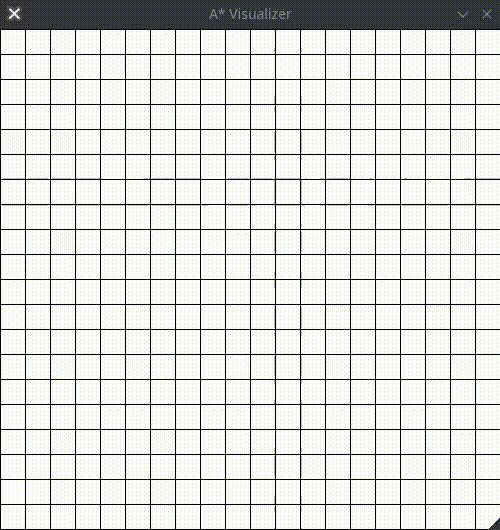

# A* Visualizer
A simple Python TK interface for visualizing the A* alghorithm




# How to use
First install tkinter
Start the application from command line with:
```bash
python mazeview.py <size>
```
The size is the number of squares on each side of the grid. The default value is 20.  
This application is not finished. If you want to clear the grid you have to restart the application. I have still to insert some error control, if there is no start or finish the application will probably crash. 
You can click more than one time on the grid when inserting start and finish points, the old point will be removed.

Command | Result  
------------ | -------------  
Press 'm' |  Modify mode, click and move your mouse to draw lines inside the grid 
Double Left Click | Add goal
Right Click | Add start
Press 'c' | Start the A* alghorithm

# Future Aims
I think I will expand the application in order to visualize:
- BFS
- DFS
- IDA
- IDA*
- Other graph searching alghorithms
