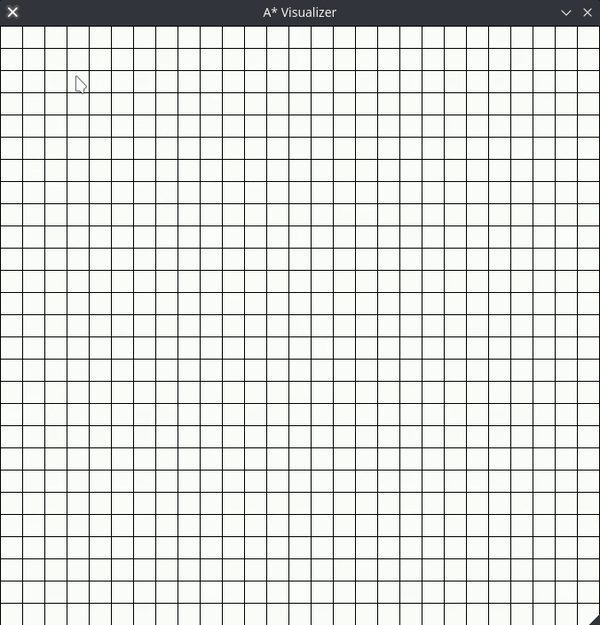

# A* Visualizer
A simple Python TK interface for visualizing the A* alghorithm and Prim's alghorithm for maze generation.


 
 

# Dependencies
- Tkinter
- Python 3

# How to use
Start the application from command line with (make asvisual.sh executable):
```bash
./asvisual.sh <heigth> <width> <square size>
```
The size is the number of squares on each side of the grid. The default value is 27x37. The square size is the number of pixel in the squares sides. The default size is 25.
I have still to insert some error control, if there is no start or finish the application will probably crash. 
You can click more than one time on the grid when inserting start and finish points, the old point will be removed.

Command | Result  
------------ | -------------  
Press 'm' |  Modify mode, click and move your mouse to draw lines inside the grid 
Double Left Click | Add goal
Right Click | Add start
Press 'c' | Start the A* alghorithm
Press 'r' | Clear the board
Press 'g' | Automatically generate new labyrinth using Prim's alghorithm
Press 'd' | Enable / Disable diagonal path searching (Default = False). This value is reset to False every time you press 'g'


# Future Aims
I think I will expand the application in order to visualize:
- BFS
- DFS
- IDA
- IDA*
- Other graph searching alghorithms
